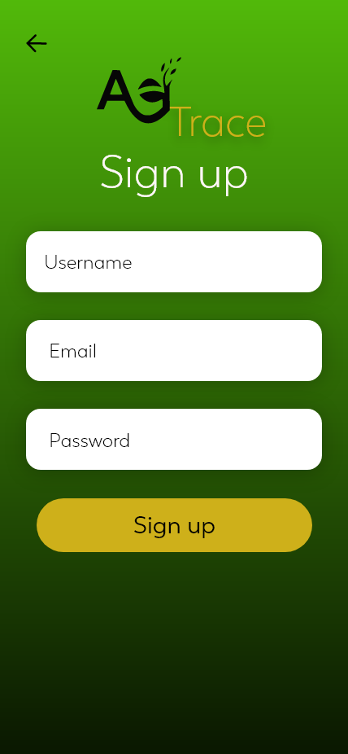
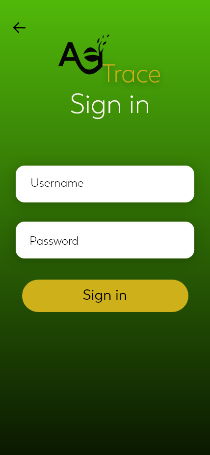
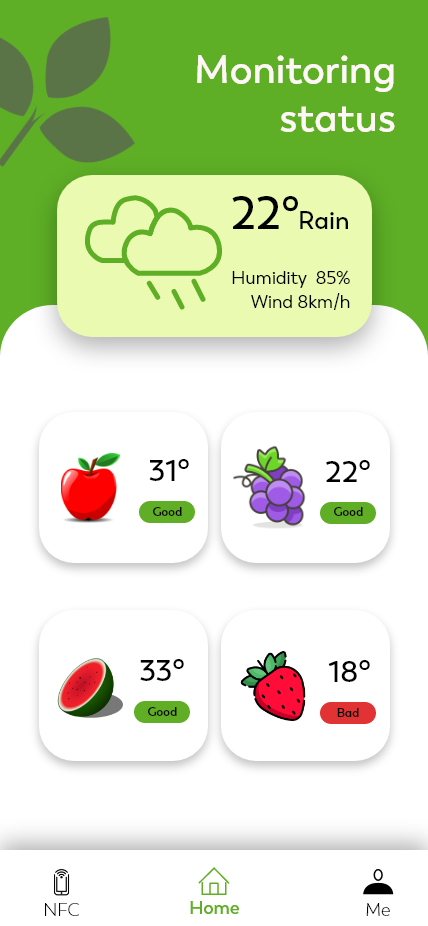
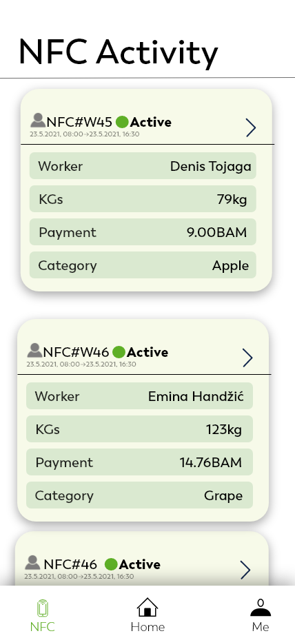
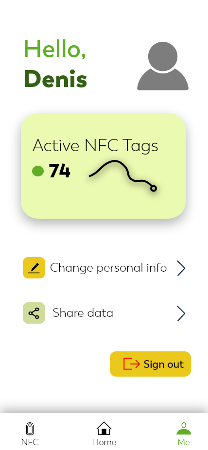

# AGTrace

 

## VIRAL Erasmus+ Hackathon 2021 2nd place

### React Native mobile application made in 48h as a solution for general problem of agriculture, which is the monitoring of worker efficiency and adequate insight into all stages of product movement. The application would be based on NFC technology by using NFC stickers and NFC readers. 

## Technologies used

- Adobe XD
- React Native
- MongoDB

## App Images

  
      
    

